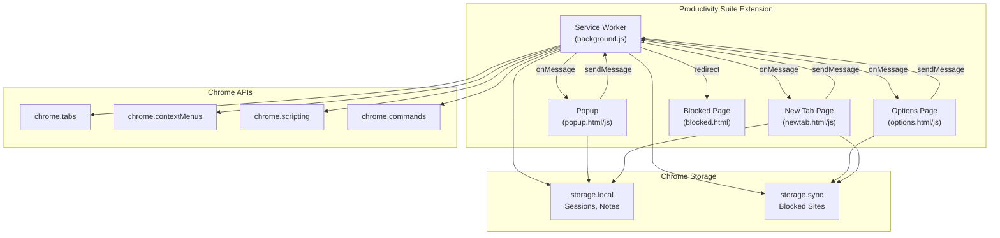
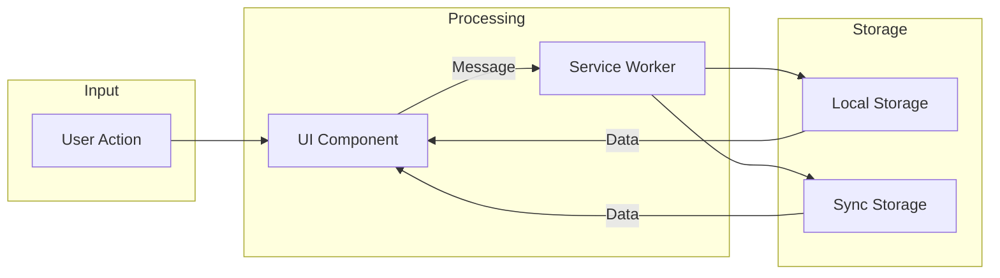
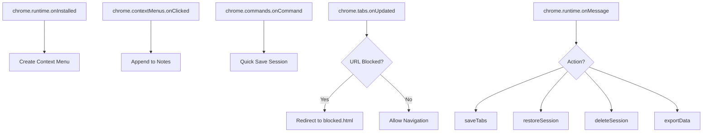

# Architecture

## System Overview

The Productivity Suite follows a modular event-driven architecture using Chrome's Manifest V3 platform.

## Component Diagram



## Data Flow



## Storage Strategy

| Data | Storage Type | Reason |
|---|---|---|
| Tab Sessions | `storage.local` | Large data, device-specific |
| Notes | `storage.local` | Can grow large |
| Blocked Sites | `storage.sync` | Small config, syncs across devices |

## Message Protocol

All inter-component communication uses `chrome.runtime.sendMessage` with this pattern:

```
{ action: "actionName", ...params }
```

### Supported Actions

| Action | Sender | Handler | Description |
|---|---|---|---|
| `saveTabs` | Popup, New Tab | Service Worker | Save current window tabs |
| `restoreSession` | Popup, New Tab | Service Worker | Open session in new window |
| `deleteSession` | Popup | Service Worker | Remove a saved session |
| `exportData` | Options, New Tab | Service Worker | Get all data for export |

## Event Listeners


