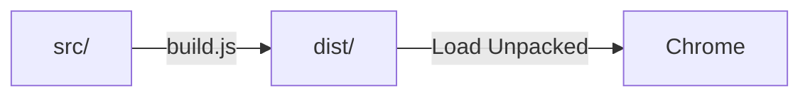

# Development Guide

## Project Setup

```bash
git clone <repo-url>
cd Chrome-Extension
npm install
npm run build
```

## Loading the Extension

1. Open `chrome://extensions` in Chrome.
2. Toggle **Developer mode** on.
3. Click **Load unpacked** → select the `dist/` folder.
4. The extension icon appears in the toolbar.

## Debugging

### Popup
Right-click the extension icon → **Inspect popup**.

### Service Worker
Go to `chrome://extensions` → find the extension → click **service worker** link.

### Options Page
Right-click the extension icon → **Options**, then use Chrome DevTools.

### New Tab Page
Open a new tab → use Chrome DevTools (`F12`).

## Build Workflow



The build script (`build.js`) simply copies all files from `src/` to `dist/`. No transpilation or bundling is needed since we use vanilla JS, HTML, and CSS.

## File Responsibilities

| File | Role |
|---|---|
| `manifest.json` | Extension metadata, permissions, and component declarations |
| `background.js` | Service worker handling events, message passing, and blocking |
| `popup.html/js` | Main user interface for sessions and notes |
| `options.html/js` | Settings page for website blocker and data export |
| `newtab.html/js` | Custom new tab dashboard with widgets |
| `blocked.html` | Displayed when a blocked site is accessed |
| `styles/common.css` | Shared design tokens and glassmorphism components |

## Testing Checklist

- [ ] Save a tab session with 3+ tabs
- [ ] Restore a saved session (opens in new window)
- [ ] Delete a session
- [ ] Write and save notes in the popup
- [ ] Verify notes persist after reopening popup
- [ ] Add a hostname to the blocklist
- [ ] Navigate to a blocked site (should redirect)
- [ ] Remove a site from the blocklist
- [ ] Verify new tab page shows notes and sessions
- [ ] Right-click → "Add page to notes"
- [ ] Export data as JSON
- [ ] Test keyboard shortcuts (Ctrl+Shift+P, Ctrl+Shift+S)
