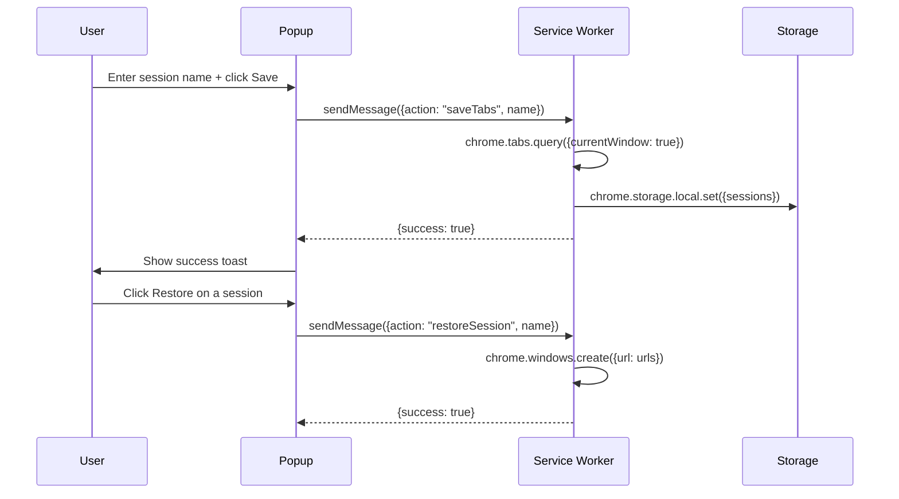
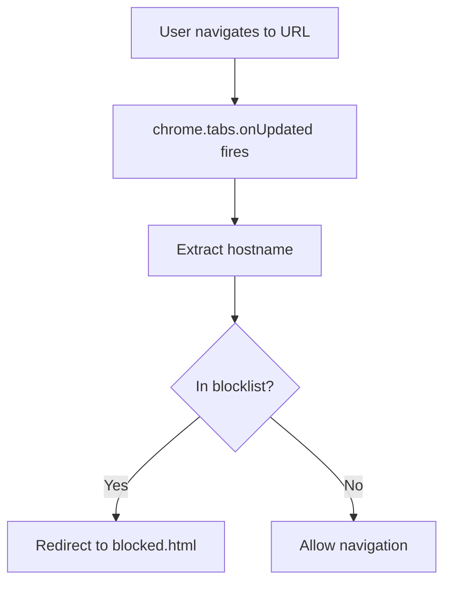

# Feature Reference

## 1. Tab Session Management

Save all open tabs in the current window as a named session. Restore any session later — it opens in a fresh window.

### Workflow



### Storage Key
- **Key:** `sessions`
- **Location:** `chrome.storage.local`
- **Format:** `{ "session-name": { urls: [...], createdAt: "ISO string" } }`

---

## 2. Notes

A simple text editor in the popup. Notes are saved to local storage and displayed on the new tab page.

### Storage Key
- **Key:** `notes`
- **Location:** `chrome.storage.local`
- **Format:** Plain text string

---

## 3. Website Blocker

Block distracting websites by adding hostnames to a blocklist on the options page. The service worker intercepts navigation and redirects to a blocked page.

### Blocking Flow



### Storage Key
- **Key:** `blockedSites`
- **Location:** `chrome.storage.sync`
- **Format:** `["facebook.com", "twitter.com", ...]`

---

## 4. New Tab Override

Chrome's default new tab is replaced with a custom dashboard showing:
- Live clock and greeting
- Saved notes widget
- Saved sessions widget
- Blocked sites widget
- Quick action buttons

---

## 5. Keyboard Shortcuts

| Command | Shortcut | Action |
|---|---|---|
| `_execute_action` | `Ctrl+Shift+P` | Open the popup |
| `save-session` | `Ctrl+Shift+S` | Quick save current tabs |

---

## 6. Context Menu

Right-click on any page → **"Add page to notes"** appends the page title and URL to your notes.

---

## 7. Data Export

Export all stored data as `productivity_suite_export.json` from the options page.

### Export Schema

```json
{
  "sessions": {},
  "notes": "",
  "blockedSites": []
}
```
